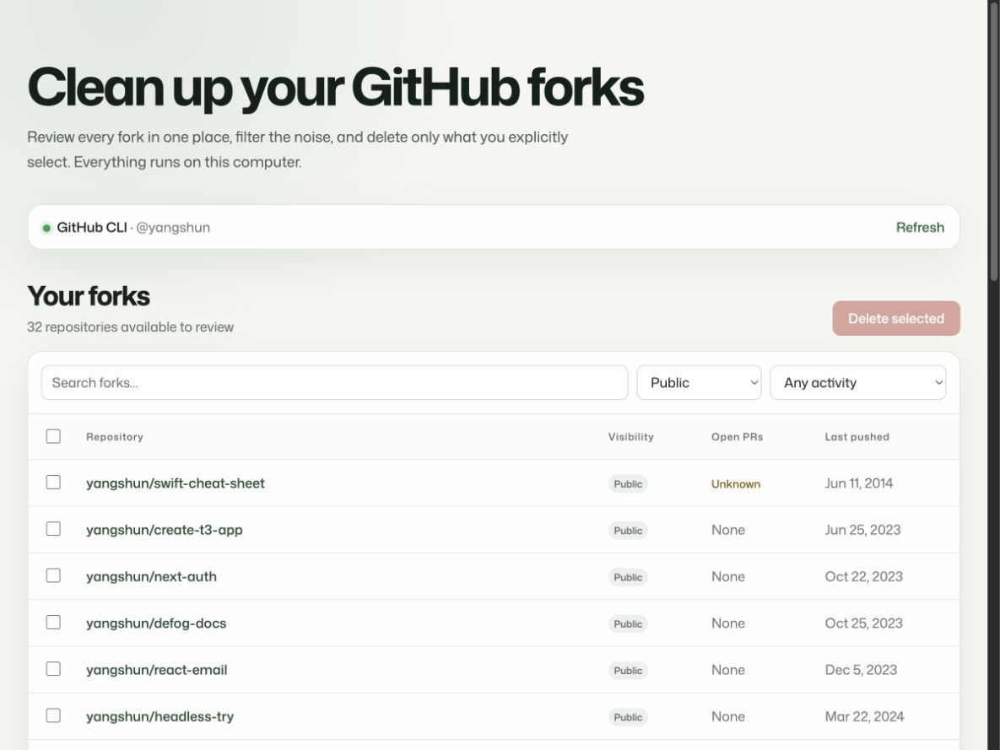

# Delete GitHub Forks

A safe, local web app for reviewing and deleting GitHub forks in bulk.



## Quick start

You need Node.js 20.19 or newer. Run the latest published version directly from npm—no clone or global installation required:

```sh
npx delete-github-forks@latest
```

The command:

1. Downloads the package temporarily through npm.
2. Starts a local server at `http://127.0.0.1:4173`.
3. Opens the app in your default browser.
4. Detects your GitHub CLI authentication automatically.

The server runs only on your computer and stops when you press <kbd>Ctrl</kbd> + <kbd>C</kbd>. If port 4173 is occupied, the app uses the next available port.

### Command options

Use a specific port:

```sh
npx delete-github-forks@latest --port 8080
```

Start the server without opening a browser:

```sh
npx delete-github-forks@latest --no-open
```

All options:

```text
--port <number>  Use a specific port (default: 4173, then next available)
--no-open        Do not open the browser automatically
-h, --help       Show command help
```

## Authentication

### GitHub CLI (recommended)

The app automatically detects an authenticated [GitHub CLI](https://cli.github.com/) session. On a fresh computer, sign in and request repository deletion access in one step:

```sh
gh auth login -h github.com -s delete_repo --web
```

If you are already signed in without the required permission, add it to your existing session:

```sh
gh auth refresh -h github.com -s delete_repo
```

No access token needs to be created, copied, or stored by the app.

### Personal access token

If GitHub CLI is unavailable, enter a personal access token in the local webpage. The token is sent only to the server on `127.0.0.1`, held in process memory for the current session, and never written to disk, browser storage, logs, cookies, or URLs.

- Classic tokens need the `repo` and `delete_repo` scopes.
- Fine-grained tokens need **Metadata: Read**, **Pull requests: Read**, and **Administration: Read and write** for each repository they may delete.

## How it works

1. The app fetches all public and private forks owned by the authenticated account.
2. It checks every fork branch for open pull requests that still depend on it.
3. Filter by repository name, visibility, or last activity.
4. Select only the repositories you want to delete. Bulk selection skips forks with open pull requests or an unknown check result.
5. Review the exact list and type `DELETE` to confirm.
6. The app deletes repositories sequentially and reports every success or failure.

Deletion is irreversible. Nothing is selected by default, and the server only accepts repositories from the list fetched during the current session.

## Build and run from source

If you prefer to inspect the code before running it, clone the repository and build the application locally instead of executing the published npm package:

```sh
git clone https://github.com/yangshun/delete-github-forks.git
cd delete-github-forks
npm install
npm run build
npm start
```

The app opens automatically at `http://127.0.0.1:4173`. You can also pass command options through npm:

```sh
npm start -- --no-open
npm start -- --port 8080
```

You can also verify the source and local build before running the app:

```sh
npm run typecheck
npm test
npm run build
```

The frontend uses React, TypeScript, Vite, and Mona Sans. The local API uses Hono on Node.js.

## License

MIT
